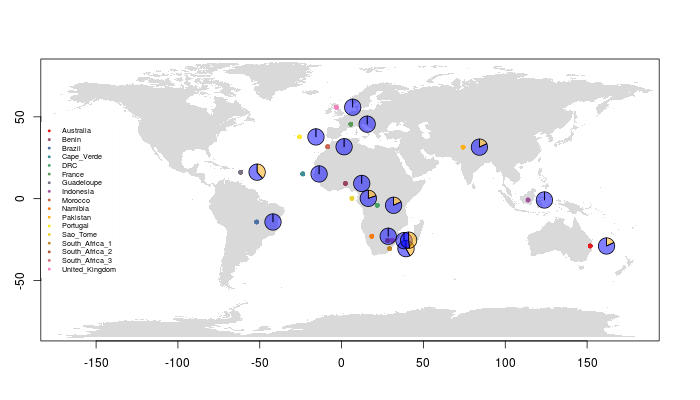

# Helminths 2019 - Genetic Diversity module

## Software needed
```shell
samtools-1.6
bcftools-1.9
bwa 0.7.17-r1188
R-3.5.0
```


## Working directory for Module development
```shell
# move to workign directory

cd /nfs/users/nfs_s/sd21/lustre118_link/WTAC/HELMINTHS_2019

cd /nfs/users/nfs_s/sd21/lustre118_link/WTAC/HELMINTHS_2019/data/Module_GeneticDiversity

```

## Get and prepare some raw data
Extracting mtDNA reads already mapped to the HCON_V4 genome from my populaiton genetics analysis.
``` shell
# extact reads on mtDNA
#-- new bams: /nfs/users/nfs_s/sd21/lustre118_link/hc/GENOME/POPULATION_DIVERSITY/MAPPING/MERGED_BAMS
#-- GS bams: /nfs/users/nfs_s/sd21/lustre118_link/hc/GENOME/POPULATION_DIVERSITY/GS_ORIGINAL/MAPPING

for i in $( cd MERGED_BAMS ; ls -1 *.merged.bam) ; do \
	samtools view -f3 -b MERGED_BAMS/${i} hcontortus_chr_mtDNA_arrow_pilon | \
    samtools sort -n -o ${i}.sorted - ; \
    samtools fastq -1 ${i%%.merged.bam}_1.fq.gz -2 ${i%%.merged.bam}_2.fq.gz ${i}.sorted ; \
    rm ${i}.sorted; \
    done

for i in $( cd MAPPING ; ls -1 *.merged.bam) ; do \
	samtools view -f3 -b MAPPING/${i} hcontortus_chr_mtDNA_arrow_pilon | \
    samtools sort -n -o ${i}.sorted - ; \
    samtools fastq -1 ${i%%.merged.bam}_1.fq.gz -2 ${i%%.merged.bam}_2.fq.gz ${i}.sorted ; \
    rm ${i}.sorted; \
    done

# found that downsampling to 5000 reads is sufficient for mapping and SNP calling, while at the same time minimising the file size footprint. Using seqtk to downsample

for i in *.gz; do  seqtk sample -s100  ${I} 5000 > ${i%%.fq.gz}.fastq; gzip ${i%%.fq.gz}.fastq; done &
```


## mapping to the mtDNA genome
Will perform this in two parts for the module, first with a single sample, and second looping over all samples


## mapping - single sample
``` shell

cd /nfs/users/nfs_s/sd21/lustre118_link/WTAC/HELMINTHS_2019/data/Module_GeneticDiversity/MAPPING

#-- get reference - need to provide this

cp ../../../../../hc/GENOME/REF/hcontortus_chr_mtDNA_arrow_pilon.fa .

#-- get reads

ln -s ../RAW_READS/ZAI_ZAI_OA_014_1.fastq.gz
ln -s ../RAW_READS/ZAI_ZAI_OA_014_2.fastq.gz


#-- perform mapping using bwa mem
#--- index the reference sequence

bwa index hcontortus_chr_mtDNA_arrow_pilon.fa

# perform mapping to generate a sam file
bwa mem hcontortus_chr_mtDNA_arrow_pilon.fa ZAI_ZAI_OA_014_1.fastq.gz ZAI_ZAI_OA_014_2.fastq.gz > ZAI_ZAI_OA_014.tmp.sam
# >> look at the sam file, and explain what is in it

# convert a sam file to a bam file, filtering out reads with a quality score less than 15
samtools view -q 15 -b -o ZAI_ZAI_OA_014.tmp.bam ZAI_ZAI_OA_014.tmp.sam

# sort the bam file
samtools sort ZAI_ZAI_OA_014.tmp.bam -o ZAI_ZAI_OA_014.sorted.bam

# index the bam file
samtools index ZAI_ZAI_OA_014.sorted.bam

#--- this will be visualised in Artemis, which we can explore looking at mapped reads etc
```


## SNP calling - single sample
```shell
#-- use bcftools mpileup to call variants

bcftools-1.9 mpileup -Ou -f hcontortus_chr_mtDNA_arrow_pilon.fa ZAI_ZAI_OA_014.sorted.bam  | bcftools-1.9 call -v -c --ploidy 1 -Ob --skip-variants indels > ZAI_ZAI_OA_014.bcf

#-- index the bcf

bcftools index ZAI_ZAI_OA_014.bcf

# convert the the bcf to a vcf file

bcftools-1.9 view ZAI_ZAI_OA_014.bcf -Oz > ZAI_ZAI_OA_014.vcf.gz

tabix -p vcf ZAI_ZAI_OA_014.vcf.gz

#--- this can be viewed in Artemis
```


## Mapping - multiple samples
``` shell
# Perform mapping on all samples
#-- to do this step, we are going to use a "for loop"
#-- this loop will iterate over the samples, running through the mapping pipeline for each sample until they are all complete
for i in $( cd ../RAW_READS ; ls -1 *_1.fastq.gz | sed 's/_1.fastq.gz//g'); do
# map reads
bwa mem hcontortus_chr_mtDNA_arrow_pilon.fa ../RAW_READS/${i}_1.fastq.gz ../RAW_READS/${i}_2.fastq.gz > ${i}.tmp.sam ;
# convert sam to bam
samtools view -q 15 -b -o ${i}.tmp.bam ${i}.tmp.sam ;
#sort reads
samtools sort ${i}.tmp.bam -o ${i}.sorted.bam ;
# index the bam
samtools index ${i}.sorted.bam ;
# remove files you dont need
rm *tmp*;
done
```

## SNP calling - multiple samples
```shell
# lets call SNPs in from the multiple samples
#-- we are going to make a file - "bam.list" - containing all samples that will be used to call SNPs

ls -1 *.sorted.bam > bam.list

#-- call SNPs from the samples listed in the bam list, to generate a multi-sample bcf

bcftools-1.9 mpileup -Ou --annotate FORMAT/DP -f hcontortus_chr_mtDNA_arrow_pilon.fa --bam-list bam.list | bcftools-1.9 call -v -c --ploidy 1 -Ob --skip-variants indels  > all_samples.bcf

# index the multi-sample bcf

bcftools index all_samples.bcf

# convert the bcf to a vcf

bcftools-1.9 view all_samples.bcf -Oz > all_samples.vcf.gz

# index the vcf

tabix -p vcf all_samples.vcf.gz

```

```shell
# filter SNPs in the vcf by minor allele frequency (MAF) and allele count to generate a new, filtered VCF file

vcftools-0.1.14 --gzvcf all_samples.vcf.gz --maf 0.05 --min-alleles 2 --max-alleles 2 --recode --out all_samples.filtered

```

## Analysis
The next stages of the analysis will be performed using the proramming language R.  
```shell
# In the unix shell, load R

R-3.5.0
```


``` R
# Welcome to R!
#-- We first need to Load the required packages
#-- Our analysis will use a number of R packages that we need to load into the working environment

#-- data manipulation
library(dplyr)
library(reshape2)

#-- making figures
library(ggplot2)
library(patchwork)
library(ggrepel)
library(ggtree)
library(RColorBrewer)

#-- making maps
library(ggmap)
library(maps)
library(mapdata)
library(plotrix)
library(mapplots)

#-- population genetics
library(adegenet)
library(vcfR)
library(poppr)
library(ape)
library(adegenet)
library(pegas)
library(mmod)
library(apex)


# Prepare your data
#-- we need to specify your input files to be read into R
#--

vcf_file  <-  "all_samples.filtered.recode.vcf"
dna_file  <-  "hcontortus_chr_mtDNA_arrow_pilon.fa"
metadata_file  <-  "../sample_metadata.txt"

#-- read the input files into R
vcf  <-  read.vcfR(vcf_file, verbose = FALSE)
dna  <-  ape::read.dna(dna_file, format = "fasta")
metadata  <-  read.table(metadata_file, header = T)

# convert your vcf file into a data frame that R can interpret
#-- we are using a "genlite" format, which is good for storing large genomic data
#-- we will add the country information from our metadata as our populations that we will do some analysis on
#-- as we are workng on mtDNA, we will set the ploidy to 1

vcf.gl	<-	vcfR2genlight(vcf)
pop(vcf.gl)  <-  metadata$country
ploidy(vcf.gl)  <-  1


# lets setup some colours to use throughout
#--- we are using the colour palette from ColourBrewer, setting a range from the "Set1" colours with 18 steps

cols  <-  colorRampPalette(brewer.pal(8, "Set1"))(17)
```

## Principal component analysis
Principal component analysis (PCA) is a common dimension reduction technique used in genomics for data exploration.
```R
# Perform a PCA
#---
vcf.pca  <-  glPca(vcf.gl, nf = 10)
vcf.pca.scores  <-  as.data.frame(vcf.pca$scores)
vcf.pca.scores$country  <-  metadata$country

#--- Lets calculate the amount of variance each principal component describes. We will use this in the plots
var_frac  <-  vcf.pca$eig / sum(vcf.pca$eig) * 100
PC1_variance  <-  formatC(head(vcf.pca$eig)[1] / sum(vcf.pca$eig) * 100)
PC2_variance  <-  formatC(head(vcf.pca$eig)[2] / sum(vcf.pca$eig) * 100)
PC3_variance  <-  formatC(head(vcf.pca$eig)[3] / sum(vcf.pca$eig) * 100)
PC4_variance  <-  formatC(head(vcf.pca$eig)[4] / sum(vcf.pca$eig) * 100)

#--- plot eigenvectors
barplot(100 * vcf.pca$eig / sum(vcf.pca$eig), col = heat.colors(50), main = "PCA Eigenvalues")
title(ylab = "Percent of variance\nexplained", line = 2)
title(xlab = "Eigenvalues", line = 1)


# make a basic plot of the first two principal components
pca_plot_pc12  <-  ggplot(vcf.pca.scores, aes(PC1, PC2, col = country)) +
				geom_point()

# lets add some labels
pca_plot_pc12 <- pca_plot_pc12 +
				labs(x = paste0("PC1 variance = ",PC1_variance,"%"),y = paste0("PC2 variance = ", PC2_variance, "%"))

# lets add some colours per country
pca_plot_pc12 <- pca_plot_pc12 +
				geom_point(aes(col = country)) +
				stat_ellipse(level = 0.95, size = 1)


# plot principal components 3 and 4, and we will compare them to 1 and 2
pca_plot_pc34 <- ggplot(vcf.pca.scores, aes(PC3, PC4, col = country)) +
				geom_point() +
				stat_ellipse(level = 0.95, size = 1) + labs(x = paste0("PC3 variance = ",PC3_variance, "%"),y=paste0("PC4 variance = ", PC4_variance, "%"))


# calculate the mean value of the principal components for each country. We can use this to make some labels for our plots
means = vcf.pca.scores %>% group_by(country) %>% summarize(meanPC1 = mean(PC1),meanPC2 = mean(PC2),meanPC3 = mean(PC3),meanPC4 = mean(PC4))

# label plot with mean values labels for each country
pca_plot_pc12 <- pca_plot_pc12 + geom_label_repel(data = means,aes(means$meanPC1, means$meanPC2, col = means$country, label = means$country))


# lets look at the large cluster in more detail
pca_plot_pc12_zoom <- pca_plot_pc12 +
					xlim(5,10) +
					ylim(-1,0.5) + geom_label_repel(data = means,aes(means$meanPC1, means$meanPC2, col = means$country, label = means$country))		

pca_plot_pc12 + pca_plot_pc12_zoom
ggsave("PCA_plots.pdf", height=10, width=15, useDingbats = FALSE)
ggsave("PCA_plots.png", height=10, width=15)
```

```shell
scp sd21@pcs5.internal.sanger.ac.uk:/nfs/users/nfs_s/sd21/lustre118_link/WTAC/HELMINTHS_2019/data/Module_GeneticDiversity/MAPPING/PCA_plots*  ~/Documents/workbook/wtac_helminths_2019/04_analysis
```

Fig - PCA plots


## Questions
#1.
#2.
#3.

## Generate a tree based on genetic distances between samples

```R
#--- generate a pairwise distance matrix from the mtDNA vcf, which we will use to make a tree
tree_data <- aboot(vcf.gl, tree = "upgma", distance = bitwise.dist, sample = 100, showtree = F, cutoff = 50, quiet = T)

#--- plot the tree
ggtree(tree_data) +
	geom_tiplab(size = 2, color = cols[pop(vcf.gl)]) +
	xlim(-0.1, 0.3) +
	geom_nodelab(size = 2, nudge_x = -0.006, nudge_y = 1) +
	theme_tree2(legend.position = 'centre')

ggsave("tree_plots.pdf", height=15, width=10, useDingbats = FALSE)
ggsave("tree_plots.png", height=15, width=10)
```

```shell
scp sd21@pcs5.internal.sanger.ac.uk:/nfs/users/nfs_s/sd21/lustre118_link/WTAC/HELMINTHS_2019/data/Module_GeneticDiversity/MAPPING/tree_plots*  ~/Documents/workbook/wtac_helminths_2019/04_analysis
```

Fig - Tree of genetic distance


## Quantitative analysis of genetic differentiation
In this section we will calculate the variant allele frequency per population (we will   
use these later when we make a map), and calculate pairwise genetic differentiaiton   
between populations.  


```R
#--- quantitative differentiation
#--- allele frequencies
myDiff_pops  <-  genetic_diff(vcf,pops = vcf.gl@pop)
AF_data  <-  myDiff_pops[,c(1:20)]
AF_data  <-  melt(AF_data)
colnames(AF_data)  <-  c("CHROM","POS","country","value")
AF_data$country  <-  gsub("Hs_","",AF_data$country)

#--- extract the latitude and longitude for each country from the metadata file
coords  <-  data.frame(metadata$country, metadata$latitude, metadata$longitude)
coords  <-  unique(coords)
colnames(coords)  <-  c("country","latitude","longitude")

#--- join the allele frequency data and the latitude/longitude data together
AF_data_coords  <-  dplyr::left_join(AF_data, coords, by = "country")


#--- calculate Gst and Gst'
myDiff_pairwise  <-  pairwise_genetic_diff(vcf,pops = vcf.gl@pop)
colMeans(myDiff[,c(4:ncol(myDiff))], na.rm = TRUE)
as.matrix(colMeans(myDiff[,c(4:ncol(myDiff))], na.rm = TRUE))

```

# Visualising genetic data on a map of sampling locations
Here, we will make a map of the sampling locations, and plot the allele frequency  
data on it. This or similar may be used to explore how populations may be connected  
to each other. We will explore this by plotting SNPs that seem to have the most effect  
in driving the variance in the PCA plot.

Note that we will only be looking at one variant at a time, and the genetic signal  
that differentiate these populations is made up of many variants. However, it  
should give you an idea of what could be done integrating these data types.


```R
# select a SNP of interest based on its position
AF_SNP_coords  <-  AF_data_coords[AF_data_coords$POS == "33",]
AF_SNP_coords  <-  AF_data_coords[1175,]

# make the map
#-- this script does a couple of things.
#---- 1. makes a map, with axes
#---- 2. plots the sampling location
#---- 3. adds a pie chart for each sampling location, describing the major and minor allele frequency
#---- 4. adds a legend of the sampling location

png("map_plot.png")
par(fg = "black")
map("world", col = "grey85", fill = TRUE, border = FALSE)
map.axes()
points(metadata$longitude, metadata$latitude, cex = 1, pch = 20, col = cols[pop(vcf.gl)])
for (i in 1:nrow(AF_SNP_coords)){
   add.pie(z = c(AF_SNP_coords$value[i], 1-AF_SNP_coords$value[i]), x = AF_SNP_coords$longitude[i]+10, y = AF_SNP_coords$latitude[i], radius = 5, col = c(alpha("orange", 0.5), alpha("blue", 0.5)), labels = "")
}
legend( x = "left", legend = AF_SNP_coords$country, col = cols[as.factor(AF_SNP_coords$country)], lwd = "1", lty = 0, pch = 20, box.lwd = 0, cex = 0.7)
dev.off()

```

```shell
scp sd21@pcs5.internal.sanger.ac.uk:/nfs/users/nfs_s/sd21/lustre118_link/WTAC/HELMINTHS_2019/data/Module_GeneticDiversity/MAPPING/map_plot*  ~/Documents/workbook/wtac_helminths_2019/04_analysis
```

Fig - Map of sampling locations with allele frequency pie charts included
